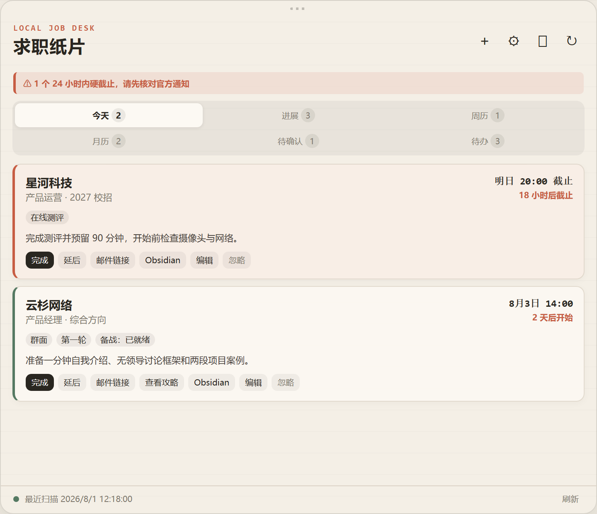
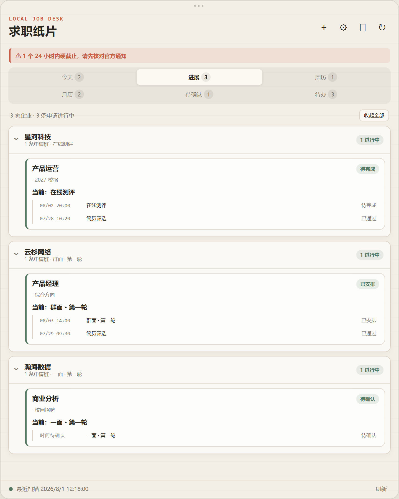
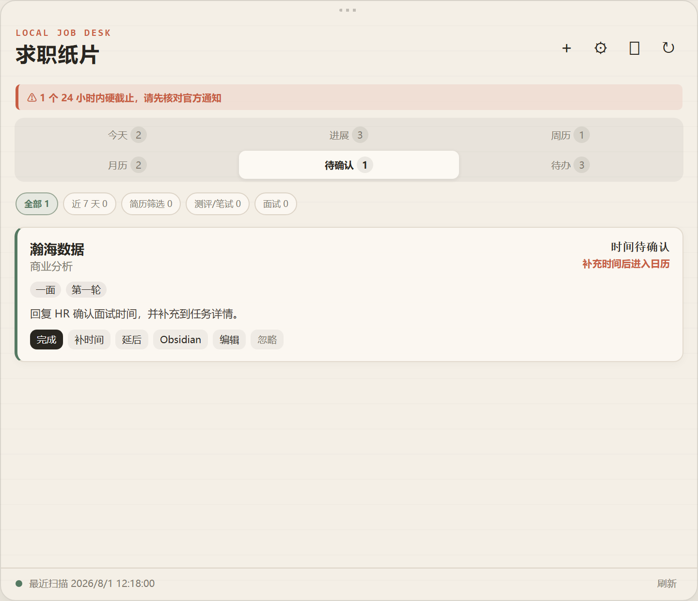
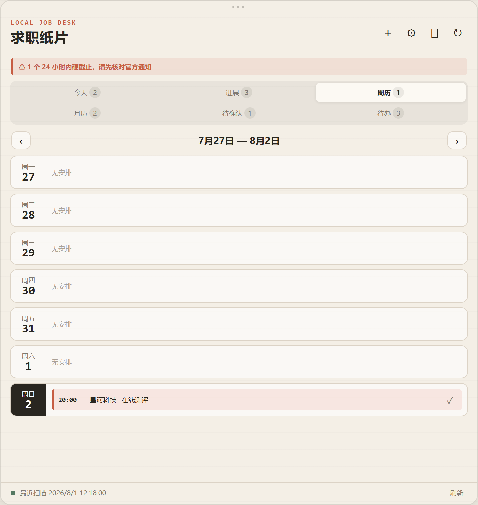
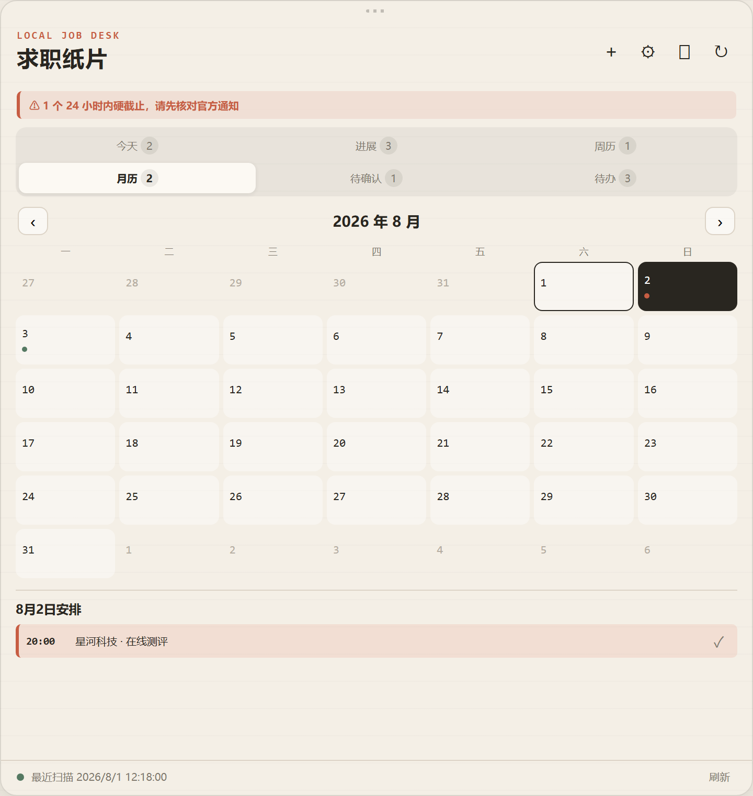
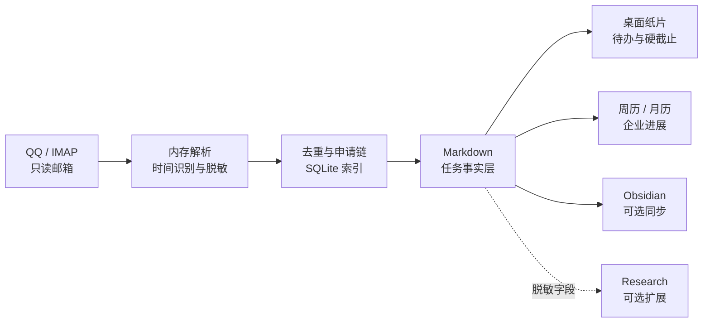

<div align="center">

# JobMailDesk · 求职纸片

**把招聘邮件变成不会错过的桌面待办、求职进展与 Markdown 日历。**

一个隐私优先的 Windows / macOS 求职邮件工作台。只读连接邮箱，本地提取公司、岗位、流程阶段和硬截止，再把下一步行动放到桌面上。

[](https://github.com/Chpeeeeea/job-mail-desk/releases)
[](#下载安装)
[](pyproject.toml)
[](https://pywebview.flowrl.com/)
[](https://github.com/Chpeeeeea/job-mail-desk/actions/workflows/build-core.yml)
[](LICENSE.md)

[下载 v0.5.0](https://github.com/Chpeeeeea/job-mail-desk/releases/tag/v0.5.0) · [快速开始](docs/CORE_QUICKSTART.md) · [隐私说明](PRIVACY.md) · [更新日志](CHANGELOG.md)

**无需安装 Python · 无需大模型 · 无需 API Key · 国内网络可直接运行 Core**

</div>

> [!IMPORTANT]
> 当前为 `v0.5.0` 预览版。Windows 与 macOS 发布包尚未完成代码签名或 Apple 公证，请只从本仓库 Release 下载，并核对同名 `.sha256` 文件。真实邮件、授权码、本地任务和私人链接不会进入公开仓库。

---

## v0.5.0 有什么新变化

| 能力 | v0.5.0 的处理方式 |
| --- | --- |
| **申请身份解析** | 邮件先按企业、招聘项目、岗位、职位编号和批次上下文归属，再生成任务；通用网申回执不会单独创建申请链。 |
| **内置基础词典** | 随程序提供 520 家企业、129 个招聘项目和 2825 个岗位名称，无需模型或 API 即可参与标准化。 |
| **个人词典** | 设置页可选择 XLSX 招聘表并在本机编译启用；源表不会上传，也不会复制进公开仓库。 |
| **待归属缓冲区** | 无法唯一判断、旧 ID 冲突或跨项目冲突的邮件会安全进入 `unresolved`，不再强行猜测。 |
| **兼容旧数据** | 保留既有 `application_id`、任务 Markdown 和 Obsidian 标记；仅在映射唯一时补充 canonical `application_key`。 |
| **更稳的桌面体验** | 设置页不再造成窗口尺寸跳变；Obsidian 临时占用台账时不会中断整批邮箱扫描。 |

这次升级的重点不是“识别更多关键词”，而是让每一封招聘邮件先回答三个问题：它属于哪家公司、哪次申请、哪一个流程节点。无法可靠回答时，JobMailDesk 会停止自动归属并等待人工确认。

---

## 5 分钟开始使用

JobMailDesk Core 是已经包含运行环境的桌面程序。普通用户不需要安装 Python、配置模型或申请 API Key。

### 1. 下载并打开

1. 前往 [GitHub Releases](https://github.com/Chpeeeeea/job-mail-desk/releases)，打开顶部最新的预览版本并下载与电脑匹配的 ZIP；
2. Windows 下载 `win-x64`，Apple 芯片 Mac 下载 `macos-arm64`，Intel Mac 下载 `macos-x64`；
3. 同时下载同名 `.sha256` 文件并核对完整性；
4. 解压后，Windows 双击 `JobMailDesk.exe`；macOS 将 `JobMailDesk.app` 拖入“应用程序”后打开。

> 预览包尚未完成代码签名。Windows SmartScreen 或 macOS Gatekeeper 可能显示来源提醒，请确认文件来自本仓库 Release 后再继续。

### 2. 准备只读邮箱连接

以 QQ 邮箱为例，在 QQ 邮箱网页版设置中开启 IMAP 服务并生成单独的授权码。配置时填写：

- 完整 QQ 邮箱地址；
- IMAP 授权码，**不是 QQ 登录密码**；
- 扫描间隔，建议保留默认 10 分钟；
- 首次启动自动回看最近 30 天；完成后按设置中的短窗口扫描，默认 3 天。

点击“测试只读邮箱连接”。程序只使用只读 IMAP 与 `BODY.PEEK`，不会删除、移动、回复邮件，也不会改变未读状态。授权码只存入 Windows Credential Manager 或 macOS Keychain。

### 3. 选择是否连接 Obsidian

- **不使用 Obsidian**：关闭“同步到 Obsidian”，任务仍会保存在本地 Markdown 中；
- **使用 Obsidian**：选择一个 `.md` 文件作为待办总览；
- 如需集中维护企业和岗位状态，再选择“求职进展输出”文档；
- 如已有岗位台账，可以选择现有台账；没有则点击“生成规范台账模板”。

点击“保存并应用”，再执行一次“立即扫描”。识别出的事项会进入“今天、待确认、待办、周历、月历、进展”视图。

### 4. 日常怎么用

- 邮件到达后，程序按设定间隔在后台只读扫描；
- 有明确时间的笔试、测评、面试或材料截止会自动进入日历；
- 没有明确时间的信息进入“待确认”，补齐后再进入计划；
- 点击卡片可以修改公司、岗位、阶段、轮次、时间和下一步行动；
- “完成”会保留灰色删除线，可以再次恢复；“忽略”后重复扫描不会让任务复活；
- 启用 Obsidian 后，卡片状态与受管 Markdown 任务会双向同步，手写区域不会被覆盖。

更详细的安装、模板格式、数据位置和更新方法见 [Core 快速开始](docs/CORE_QUICKSTART.md)。

---

## 产品预览

| 今日与硬截止 |
| :---: |
|  |

| 企业进展 |
| :---: |
|  |

| 待确认筛选 |
| --- |
|  |

| 周历 | 月历 |
| :---: | :---: |
|  |  |

> 预览全部由虚构公司和匿名任务生成，不包含真实邮箱、投递记录或私人通知链接。维护者可运行 `scripts/capture-readme-previews.ps1` 从同一演示数据重新生成高清截图。

---

## 设计原则

- **硬截止优先** — 先保护笔试、测评、面试和材料提交时间，再处理普通招聘信息。
- **邮件保持原状** — IMAP 始终只读，不删除、移动、回复邮件，也不改变未读状态。
- **Markdown 是事实层** — 任务、状态和行动保存在可读、可迁移的 Markdown 中，不被某个数据库锁定。
- **完成也能恢复** — 完成项保留为灰色删除线，再次操作即可恢复；忽略项不会被下一次扫描重新创建。
- **Core 不依赖 AI** — 邮件分类、时间解析、卡片、日历和进展全部由本地规则完成。
- **公开研究与私人邮件分离** — 可选研究功能只接收脱敏后的公司、岗位和阶段，不接触邮件正文。

---

## 项目特色

### 邮件变成行动

- QQ 邮箱和通用 IMAP 只读扫描，使用 `BODY.PEEK` 获取内容。
- 本地识别公司、岗位、招聘项目、笔试、测评、面试轮次、开始时间、结束时间和截止时间。
- 正确区分“活动取消”和“取消订阅”“违规将取消资格”等无关措辞。
- 改期邮件更新原任务；重复 `Message-ID` 和重复扫描不会重复建卡。
- 没有明确时间的通知进入“待确认”，不会猜测一个不存在的时间。
- 同一公司的投递、笔试、面试、Offer 或结束通知合并为一条申请链。

### 一张求职纸片

- `今天 / 进展 / 周历 / 月历 / 待确认 / 待办` 六个专用视图。
- 窗口置顶、记忆位置、侧边胶囊、系统托盘与单实例唤回。
- 24 小时内硬截止显示在顶部警示区，不用连续弹窗打扰。
- 卡片支持完成/恢复、延后、编辑、忽略、打开通知链接和打开 Obsidian。
- 手动任务和邮件任务共用同一事实层，保存后立即进入待办与日历。
- 最近扫描时间、下一次扫描和最近错误直接显示在纸片底部。

### Markdown 与 Obsidian

- 每个任务单独保存为 `tasks/<id>.md`，包含稳定 ID 和 YAML frontmatter。
- 可选导出标准 `- [ ]` 与 `📅 YYYY-MM-DD` 语法到任意 Obsidian Vault。
- Obsidian 勾选状态可以同步回桌面卡片，手写区域不会被自动刷新覆盖。
- 可生成独立求职进展文档；申请链和流程节点携带稳定 ID，完成项显示为已勾选。
- 求职进展按岗位生成默认折叠的 Obsidian 卡片，展开后用表格展示企业、岗位、项目、阶段、轮次、活动窗口、截止时间、完成时间、下一步和流程历史。
- 可关联用户维护的岗位投递台账。组件完成任务时，仅在稳定 ID 或“公司 + 岗位/J 编号”唯一匹配后更新当前进展，不覆盖下一步动作和其他手写内容。
- 每日 `08:00 / 13:00 / 20:00` 生成早、中、晚本地简报。

---

## 从邮件到桌面



默认每 10 分钟检查新邮件与硬截止，每小时归类并刷新任务链。SQLite 保存去重状态和扫描游标，桌面首次显示优先读取本地快照，因此重新打开不需要从头处理全部邮件。

企业名称先经过本地标准化词库：招聘通用词不会被当成公司，已核验别名按精确映射归类，事业群则保留为独立招聘项目。比如网易雷火和网易互娱同属“网易游戏”总览，但不会串入同一申请链。详见[企业、项目与阶段标准化](docs/NORMALIZATION.md)。

---

## 界面与操作手册

### 六个视图

| 视图 | 用途 |
| --- | --- |
| **今天** | 当前安排、即将开始的活动和 24 小时内硬截止 |
| **进展** | 按企业折叠浏览所有申请链，展开后查看岗位、轮次和历史节点 |
| **周历** | 以七天议程查看已确认时间的任务 |
| **月历** | 总览招聘节奏，点击日期查看当日安排 |
| **待确认** | 集中补齐邮件没有写明的时间或关键信息 |
| **待办** | 查看全部活动事项以及可以恢复的已完成事项 |

### 卡片动作

| 动作 | 实际行为 |
| --- | --- |
| **完成 / 恢复** | 完成后保留灰色删除线；再次操作恢复为待办 |
| **补时间 / 编辑** | 修改公司、岗位、阶段、轮次、时间、截止与行动说明 |
| **延后** | 暂时移出提醒区 24 小时，不修改活动本身的时间 |
| **邮件链接** | 打开邮件中提取的通知或操作链接，不打开或导出完整邮件正文 |
| **Obsidian** | 使用配置的 Obsidian URI 或系统关联打开对应任务 |
| **查看攻略** | 打开已经人工确认的公开研究草稿；Core 默认不会自行联网研究 |
| **忽略** | 永久忽略本地任务，后续重复扫描不会让它重新出现 |

完成、恢复、延后和忽略采用二次点击确认：首次点击进入 3 秒确认态，再次点击才执行，避免误触。

完成操作会同步本地任务、Obsidian 待办总览和自动生成的求职进展。若设置了人工岗位台账，程序只在目标行能够唯一确认时更新“当前进展”字段并绑定稳定申请 ID；匹配不唯一时保持台账不变，避免串改同一企业的其他岗位。

### 手动新建与编辑

点击右上角 `＋` 可以新建任务。至少填写“公司/事项”和“下一步行动”；开始、结束和硬截止均可独立设置。保存后会同步刷新：

```text
待办 → 周历 / 月历 → 企业进展 → Obsidian（若启用）
```

点击任意卡片或进展时间线节点可以重新打开详情。手动备注进入任务 Markdown 的受保护区域，自动扫描不会覆盖。

### 胶囊与系统托盘

- 点击右上角胶囊按钮将主纸片缩到屏幕边缘，点击胶囊恢复。
- 胶囊显示紧急任务数，硬截止存在时使用警示状态。
- 拖动胶囊把手可以调整所在边缘和垂直位置。
- Windows 托盘可显示、隐藏、立即扫描、暂停扫描、打开设置和退出。
- 主窗口默认可从任务栏、`Alt+Tab` 和任务视图隐藏。
- 再次启动程序只会唤回已经运行的实例，不会重复启动邮箱扫描器。

---

## 设置

首次运行会打开配置向导，之后可从右上角齿轮或 Windows 托盘再次进入。

### 邮箱与扫描

- QQ 邮箱地址；
- QQ 邮箱生成的 IMAP 授权码，而不是 QQ 登录密码；
- 扫描间隔，默认 10 分钟；
- 首次回看天数，默认 3 天；
- 只读连接测试和未读状态检查。

授权码只写入 Windows Credential Manager 或 macOS Keychain，不写入 `config.toml`、Markdown、数据库或日志。

### Obsidian 与进展文档

- Obsidian 同步可以完全关闭；
- 可选择任意 Markdown 文件作为待办总览；
- 可选择独立的求职进展输出文档；
- 可选择手动岗位投递台账；
- “生成规范台账模板”只在目标文件不存在时创建，不覆盖已有内容。
- 规范行格式为 `公司｜岗位｜当前进展｜下一步动作`；组件状态同步只修改第三段，第四段及其他手写内容始终保留。

### 企业与岗位词典

- Core 内置 520 家企业、129 个招聘项目和 2825 个岗位名称，无需模型或 API；
- 设置页可以选择自己的 XLSX 秋招表，并指定包含“公司及项目名称/职位名称”的工作表；
- 编译只在本机进行，源表不会复制进 JobMailDesk，也不会保存源路径；
- 个人导入结果进入 `dictionaries/imported/`，手工维护的 `dictionaries/manual/` 具有最高优先级；
- 通用网申回执不会仅凭公司名称创建申请，无法唯一归属的邮件进入本地待归属缓冲区。

### 版本通知

- 支持稳定版和预览版通道；
- 每天最多读取一次公开 GitHub Release；
- 只显示更新公告和下载入口；
- 不自动下载、不覆盖文件、不静默执行安装包。

---

## 下载安装

从 [v0.5.0 Release](https://github.com/Chpeeeeea/job-mail-desk/releases/tag/v0.5.0) 下载与你的电脑匹配的 ZIP：

| 系统 | 下载文件 |
| --- | --- |
| Windows 10/11 x64 | [`JobMailDesk-Core-v0.5.0-win-x64.zip`](https://github.com/Chpeeeeea/job-mail-desk/releases/download/v0.5.0/JobMailDesk-Core-v0.5.0-win-x64.zip) |
| Apple Silicon Mac（M1 及更新） | [`JobMailDesk-Core-v0.5.0-macos-arm64.zip`](https://github.com/Chpeeeeea/job-mail-desk/releases/download/v0.5.0/JobMailDesk-Core-v0.5.0-macos-arm64.zip) |
| Intel Mac | [`JobMailDesk-Core-v0.5.0-macos-x64.zip`](https://github.com/Chpeeeeea/job-mail-desk/releases/download/v0.5.0/JobMailDesk-Core-v0.5.0-macos-x64.zip) |

发布包已经包含 Python 运行时。Windows 需要系统 WebView2，Windows 11 通常已预装；macOS 使用系统 WebKit。

### 校验下载

每个 ZIP 旁边都有同名 `.sha256` 文件。下载后核对哈希：

```powershell
# Windows PowerShell
Get-FileHash .\JobMailDesk-Core-v0.5.0-win-x64.zip -Algorithm SHA256
```

```bash
# macOS
shasum -a 256 JobMailDesk-Core-v0.5.0-macos-arm64.zip
```

输出应与 `.sha256` 文件一致。预览包尚未签名，Windows SmartScreen 或 macOS Gatekeeper 可能显示来源提醒。

### 首次使用

1. 解压 ZIP；
2. Windows 双击 `JobMailDesk.exe`，macOS 将 `JobMailDesk.app` 拖入“应用程序”；
3. 输入邮箱和 IMAP 授权码；
4. 测试只读连接；
5. 按需选择 Obsidian 与求职进展 Markdown 路径；
6. 保存后执行第一次扫描。

详细步骤见 [Core 快速开始](docs/CORE_QUICKSTART.md)。

---

## 本地数据与隐私

默认数据目录：

```text
Windows: %LOCALAPPDATA%\JobMailDesk\
macOS:   ~/Library/Application Support/JobMailDesk/

JobMailDesk/
├─ config.toml              非敏感设置
├─ tasks/                   每项任务一个 Markdown 文件
├─ digests/                 早中晚本地简报
├─ state.db                 去重、扫描游标与可重建索引
├─ dashboard-cache.json     桌面快速启动快照
└─ logs/                    脱敏运行日志
```

隐私边界：

- IMAP 使用 `readonly=True` 与 `BODY.PEEK`；
- 不删除、移动、回复邮件，也不修改未读状态；
- 邮件正文只在内存中解析，不写入 Markdown、数据库或日志；
- 落盘仅保存结构化字段、脱敏摘要和本地任务关联；
- 数字通行证、验证码、邮箱、手机号、认证参数和私人 URL 会被脱敏；
- Core 不调用 OpenAI、模型 API、小红书、牛客、X、YouTube 或其他研究平台；
- 无网络时仍可查看、编辑和完成已经存在的任务。

详细说明见 [PRIVACY.md](PRIVACY.md) 与 [SECURITY.md](SECURITY.md)。

---

## 更新、备份与卸载

### 手动更新

1. 在设置或 Windows 托盘点击“检查更新”；
2. 阅读更新公告并打开下载页；
3. 下载对应 ZIP 和 `.sha256`；
4. 退出 JobMailDesk；
5. 解压并覆盖旧程序文件后重新启动。

程序文件与用户数据分离，覆盖程序不会删除任务、配置或系统凭据。详细边界见 [更新说明](docs/UPDATES.md)。

### 备份

退出程序后复制完整本地数据目录即可。Markdown 是任务事实层；`state.db` 和 `dashboard-cache.json` 均为可重建状态，但备份时建议一并保留。

### 卸载

删除程序目录只会移除应用本体。如果还要清理个人数据，请另外删除本地数据目录，并从系统凭据管理器删除 JobMailDesk 邮箱凭据。

---

## Core 与 Research

| 版本 | 定位 | 是否需要模型 |
| --- | --- | --- |
| **JobMailDesk Core** | 邮件、任务、日历、企业进展、版本通知和 Obsidian 同步 | 否 |
| **JobMailDesk Research** | 根据脱敏公司、岗位和阶段整理官方信息、牛客与公开经验来源 | 可选 |

Research 仍是独立可选扩展。Core 不会因为没有安装 Research 而缺失任何邮件或待办功能。研究结果也必须经过人工确认，才能进入正式题库或求职知识库。

---

## 文档

| 文档 | 用途 |
| --- | --- |
| [Core 快速开始](docs/CORE_QUICKSTART.md) | 首次安装、邮箱和进展台账配置 |
| [版本通知与更新](docs/UPDATES.md) | 更新通道、手动覆盖与失败边界 |
| [v0.5.0 Release Notes](docs/RELEASE_NOTES_v0.5.0.md) | 本次身份解析、词典、待归属和可靠性更新 |
| [身份词典说明](docs/IDENTITY_DICTIONARIES.md) | 内置词典、XLSX 导入、优先级与安全限制 |
| [维护、更新与发布规则](docs/MAINTENANCE.md) | 分支、版本号、PR、Release、回滚与完成标准 |
| [依赖说明](docs/DEPENDENCIES.md) | 终端用户与开发环境依赖 |
| [架构说明](docs/ARCHITECTURE.md) | 模块、数据流和本地存储 |
| [企业、项目与阶段标准化](docs/NORMALIZATION.md) | 企业别名、招聘通用词、事业群分链与时间语义 |
| [隐私说明](PRIVACY.md) | 邮件、凭据与公开研究边界 |
| [安全说明](SECURITY.md) | 漏洞报告与秘密处理规则 |
| [贡献指南](CONTRIBUTING.md) | 本地开发、测试和提交规范 |
| [第三方声明](THIRD_PARTY_NOTICES.md) | 依赖许可与设计参考边界 |
| [完整许可证](LICENSE.md) | 可机器识别的标准 MIT 条款 |
| [许可说明](docs/LICENSING.md) | 中英文授权摘要、再分发清单与第三方边界 |
| [Changelog](CHANGELOG.md) | 每个已验收阶段的功能与修复 |
| [v0.5.0 验收记录](docs/ACCEPTANCE_v0.5.0.md) | 当前版本自动化与发布验证 |
| [v0.4.2 验收记录](docs/ACCEPTANCE_v0.4.2.md) | 上一版本自动化与发布验证 |

---

<details>
<summary><strong>源码开发、CLI 与构建</strong></summary>

### 开发环境

- Python `3.12`
- [`uv`](https://docs.astral.sh/uv/)
- Windows WebView2 或 macOS WebKit

```powershell
uv sync --group dev
uv run jobmaildesk doctor --offline
uv run jobmaildesk scan --once --shadow
uv run jobmaildesk ui
```

`--shadow` 只输出脱敏结构化预览，不写任务、不导出 Obsidian，也不写研究队列。

### 常用 CLI

```text
jobmaildesk configure
jobmaildesk doctor [--offline]
jobmaildesk scan --once [--days N] [--shadow]
jobmaildesk run
jobmaildesk digest morning|noon|evening
jobmaildesk export [--obsidian]
jobmaildesk dictionary-check
jobmaildesk dictionary-compile --xlsx WORKBOOK.xlsx --output DICTIONARY_DIR [--sheet 工作表]
jobmaildesk unresolved-list
jobmaildesk unresolved-resolve SOURCE_HASH --application-key KEY
jobmaildesk unresolved-ignore SOURCE_HASH
jobmaildesk task-list [--company 公司] [--role 岗位] [--stage 阶段]
jobmaildesk task-update TASK_ID [--status done|planned|needs_review|cancelled|irrelevant]
jobmaildesk ui
jobmaildesk show
```

`unresolved` 命令只处理本地脱敏记录：无法唯一归属的邮件不会强行生成申请链，人工选择现有 `application_key` 后才会进入正式任务流程。

### 测试与构建

```powershell
uv run pytest
powershell -ExecutionPolicy Bypass -File .\scripts\secret-scan.ps1
powershell -ExecutionPolicy Bypass -File .\scripts\capture-readme-previews.ps1
powershell -ExecutionPolicy Bypass -File .\scripts\build.ps1 -OutputRoot ".\release"
powershell -ExecutionPolicy Bypass -File .\scripts\package-core.ps1 `
  -ExePath ".\release\JobMailDesk.exe" `
  -OutputDirectory ".\release"
```

标签构建由 GitHub Actions 生成 Windows x64、macOS Apple Silicon 与 macOS Intel 包，并为每个 ZIP 生成 SHA-256 文件。

</details>

---

## 发布状态与路线

- [x] Windows x64 self-contained 包
- [x] macOS Apple Silicon / Intel 包
- [x] QQ IMAP 只读扫描、任务去重与时间解析
- [x] 桌面纸片、侧边胶囊、周历、月历与企业进展
- [x] Obsidian 稳定 ID 同步
- [x] 只提示公告的版本通知
- [ ] Windows 代码签名
- [ ] macOS Developer ID 签名与 Apple 公证
- [ ] 三天真实环境稳定性试运行后提升为 stable Release
- [ ] 独立 JobMailDesk Research 扩展

---

## 许可证与设计参考

JobMailDesk 使用 [MIT License](LICENSE.md)，版权声明为 `Copyright (c) 2026 JY`。你可以使用、修改、分发和商业化，但必须保留原版权声明与 MIT 授权文本。常见场景和再分发清单见[许可说明](docs/LICENSING.md)。

[PaperTodo](https://github.com/snownico0722/PaperTodo) 仅作为纸片式桌面交互和 README 信息架构的设计研究对象。JobMailDesk 没有复制 PaperTodo 的代码、文案、截图、图标、动画或其他素材；详细边界见 [THIRD_PARTY_NOTICES.md](THIRD_PARTY_NOTICES.md)。
