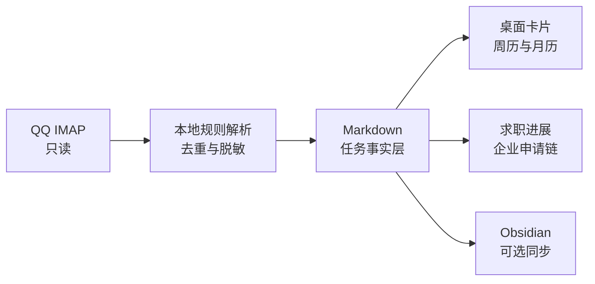

# JobMailDesk

把招聘邮件整理成桌面待办、求职进展和 Markdown 日历。

[](https://github.com/Chpeeeeea/job-mail-desk/actions/workflows/build-core.yml)
[](https://github.com/Chpeeeeea/job-mail-desk/releases/tag/v0.4.1)
[](#下载安装)
[](LICENSE)

JobMailDesk Core 是一个隐私优先、Markdown 原生的求职邮件工作台。它只读扫描 QQ 邮箱，在本机识别公司、岗位、招聘阶段和时间节点，再生成可编辑的桌面卡片、周历、月历与可选的 Obsidian 待办。

**不需要 Python，不需要大模型，不需要 API Key，也不依赖境外模型服务。**

> [!IMPORTANT]
> 当前是 `v0.4.1` 预览版。Windows 与 macOS 安装包尚未完成代码签名，安装前请确认文件来自本仓库 Release，并核对同名 `.sha256` 文件。真实邮件、授权码、本地任务和私人链接不会进入公开仓库。

## 下载安装

从 [v0.4.1 Release](https://github.com/Chpeeeeea/job-mail-desk/releases/tag/v0.4.1) 下载与你的电脑匹配的 ZIP：

| 系统 | 下载文件 |
| --- | --- |
| Windows 10/11 x64 | [`JobMailDesk-Core-v0.4.1-win-x64.zip`](https://github.com/Chpeeeeea/job-mail-desk/releases/download/v0.4.1/JobMailDesk-Core-v0.4.1-win-x64.zip) |
| Apple Silicon Mac（M1 及更新） | [`JobMailDesk-Core-v0.4.1-macos-arm64.zip`](https://github.com/Chpeeeeea/job-mail-desk/releases/download/v0.4.1/JobMailDesk-Core-v0.4.1-macos-arm64.zip) |
| Intel Mac | [`JobMailDesk-Core-v0.4.1-macos-x64.zip`](https://github.com/Chpeeeeea/job-mail-desk/releases/download/v0.4.1/JobMailDesk-Core-v0.4.1-macos-x64.zip) |

1. 同时下载同名 `.sha256` 文件并核对校验值。
2. 解压 ZIP。
3. Windows 双击 `JobMailDesk.exe`；macOS 将 `JobMailDesk.app` 拖入“应用程序”后打开。
4. 首次启动按向导配置邮箱。

发布包已经包含 Python 运行时。Windows 需要系统 WebView2，Windows 11 通常已预装；macOS 使用系统 WebKit。

### 首次配置

你只需要准备：

- 已开启 IMAP 的 QQ 邮箱；
- QQ 邮箱单独生成的 IMAP 授权码，不是 QQ 登录密码；
- 可访问 `imap.qq.com:993` 的网络。

向导中可以继续设置：

- 扫描间隔与邮件回看天数；
- Obsidian 待办 Markdown 路径；
- 求职进展输出路径；
- 手动进展台账路径及规范模板；
- 预览版或稳定版更新通知。

Obsidian 完全可选。不开启同步时，任务仍保存在本机。

## 工作方式



### 核心能力

| 能力 | 说明 |
| --- | --- |
| 邮件时间提取 | 识别笔试、测评、面试、材料补充与截止时间；没有明确时间时进入“待确认” |
| 去重与状态保持 | 重复邮件不重复建卡；完成、忽略和改期状态不会被下一次扫描复活 |
| 企业进展 | 将同一公司的投递、笔试、面试轮次、Offer 或拒信连接为申请链 |
| 周历与月历 | 手动任务和邮件任务使用同一 Markdown 事实层，保存后立即进入日历 |
| 桌面纸片 | 支持编辑、完成/恢复、延后、忽略、侧边胶囊和系统托盘入口 |
| Obsidian 同步 | 使用稳定任务 ID 双向同步勾选状态，并保护手写区域 |
| 本地简报 | 每日 `08:00 / 13:00 / 20:00` 生成新增、临期和后续安排 |
| 版本通知 | 每天最多检查一次 GitHub Release，只显示公告和下载页，不自动安装 |

默认每 10 分钟检查新邮件与硬截止。扫描只读取新内容；SQLite 保存去重和扫描游标，Markdown 保存任务事实，因此重新打开程序不需要从头处理全部邮件。

## 日常使用

- `今天`：查看当前安排与临近截止。
- `进展`：按企业折叠浏览所有申请链，展开后查看岗位、轮次与历史节点。
- `周历 / 月历`：按日期查看邮件任务和手动任务。
- `待确认`：集中补充邮件里没有写明的时间或关键信息。
- `待办`：查看全部活动事项和可恢复的已完成事项。
- `＋`：手动新建任务；保存后同步刷新待办、日历、进展和 Obsidian。
- `▯`：折叠为侧边胶囊；拖动点阵可切换屏幕边缘与位置。

完成、恢复、延后和忽略都需要在 3 秒内再次点击确认。完成项不会直接消失，而是保留为灰色删除线，并可再次恢复。

Windows 版由系统托盘管理，主窗口默认不出现在任务栏、`Alt+Tab` 或任务视图中。双击桌面或开始菜单快捷方式只会唤回已有窗口，不会重复启动扫描器。

## 隐私边界

JobMailDesk Core 的默认边界是“邮件只读、解析本地、用户确认”：

- IMAP 始终使用 `readonly=True` 与 `BODY.PEEK`；
- 不删除、移动、回复邮件，也不修改未读状态；
- 邮件正文只在内存中解析，不写入 Markdown、数据库或日志；
- 落盘内容仅包含结构化字段、脱敏摘要和本地来源链接；
- 授权码只进入 Windows Credential Manager 或 macOS Keychain；
- Core 不调用 OpenAI、模型 API、小红书、牛客、X、YouTube 或其他研究平台；
- GitHub 无法访问时，邮件扫描、任务、日历与 Obsidian 仍可正常工作。

详细边界见 [PRIVACY.md](PRIVACY.md) 与 [SECURITY.md](SECURITY.md)。

## 数据、更新与卸载

本地数据默认保存在：

```text
Windows: %LOCALAPPDATA%\JobMailDesk
macOS:   ~/Library/Application Support/JobMailDesk
```

其中 Markdown 是任务事实层，SQLite 只保存邮件去重、扫描状态和可重建索引。

从 `v0.4.0` 开始，程序可以提示新版本，但不会自动下载、覆盖、执行或重启：

1. 在设置页或 Windows 托盘点击“检查更新”；
2. 阅读更新公告并打开下载页；
3. 下载对应 ZIP 与 `.sha256`；
4. 退出程序后手动覆盖旧版本。

覆盖或删除程序文件不会自动删除本地任务、配置和系统凭据。升级说明见 [docs/UPDATES.md](docs/UPDATES.md)。

## Core 与 Research

公开发布的 **JobMailDesk Core** 完全本地运行，负责邮件、任务、日历、进展和 Obsidian。

规划中的 **JobMailDesk Research** 是独立可选扩展，用于根据脱敏后的公司、岗位和阶段检索企业官方、牛客、X、小红书、抖音、GitHub 与 YouTube。Core 不会因为没有安装 Research 而缺失任何邮件或待办功能，研究结果也必须经过人工确认才能进入正式题库。

## 文档

| 文档 | 用途 |
| --- | --- |
| [快速开始](docs/CORE_QUICKSTART.md) | 首次安装、邮箱与进展台账配置 |
| [版本通知与更新](docs/UPDATES.md) | 更新通道、手动覆盖与失败边界 |
| [依赖说明](docs/DEPENDENCIES.md) | 终端用户与开发环境依赖 |
| [架构说明](docs/ARCHITECTURE.md) | 模块、数据流和本地存储 |
| [隐私说明](PRIVACY.md) | 邮件、凭据和公开研究边界 |
| [安全说明](SECURITY.md) | 漏洞报告与秘密处理规则 |
| [Changelog](CHANGELOG.md) | 每个已验收阶段的功能与修复 |
| [v0.4.1 验收记录](docs/ACCEPTANCE_v0.4.1.md) | 当前版本自动化与发布验证 |

<details>
<summary><strong>源码开发与 CLI</strong></summary>

### 开发依赖

- Python `3.12`
- [`uv`](https://docs.astral.sh/uv/)

```powershell
uv sync --group dev
uv run jobmaildesk doctor
uv run jobmaildesk scan --once --shadow
uv run jobmaildesk ui
```

`--shadow` 只输出脱敏结构化预览，不写任务、不导出 Obsidian，也不写研究队列。

### 常用 CLI

```text
jobmaildesk configure
jobmaildesk doctor [--offline]
jobmaildesk scan --once [--days N] [--shadow]
jobmaildesk run
jobmaildesk digest morning|noon|evening
jobmaildesk export [--obsidian]
jobmaildesk task-list [--company 公司] [--role 岗位] [--stage 阶段]
jobmaildesk task-update TASK_ID [--status done|planned|needs_review|cancelled|irrelevant]
jobmaildesk ui
jobmaildesk show
```

### 验证与 Windows 构建

```powershell
uv run pytest
powershell -ExecutionPolicy Bypass -File .\scripts\secret-scan.ps1
powershell -ExecutionPolicy Bypass -File .\scripts\build.ps1 -OutputRoot ".\release"
powershell -ExecutionPolicy Bypass -File .\scripts\package-core.ps1 `
  -ExePath ".\release\JobMailDesk.exe" `
  -OutputDirectory ".\release"
```

标签构建由 GitHub Actions 生成 Windows x64、macOS Apple Silicon 与 macOS Intel 包，并为每个 ZIP 生成 SHA-256 文件。

</details>

## 发布状态与路线

- [x] Windows x64 self-contained 包
- [x] macOS Apple Silicon / Intel 包
- [x] QQ IMAP 只读扫描、任务去重与时间解析
- [x] 桌面纸片、胶囊、周历、月历和企业进展
- [x] Obsidian 稳定 ID 同步
- [x] 只提示公告的版本通知
- [ ] Windows 代码签名
- [ ] macOS Developer ID 签名与 Apple 公证
- [ ] 三天真实环境稳定性试运行后提升为 stable Release
- [ ] 独立的 JobMailDesk Research 插件

当前预览包未签名，因此 Windows SmartScreen 或 macOS Gatekeeper 可能显示提醒。正式稳定版发布前将补齐签名、公证与真实设备验收。

## 许可证

[MIT License](LICENSE)。PaperTodo 仅作为纸片式桌面交互的设计参考，未复制其代码或素材；第三方项目与许可边界见 [THIRD_PARTY_NOTICES.md](THIRD_PARTY_NOTICES.md)。
